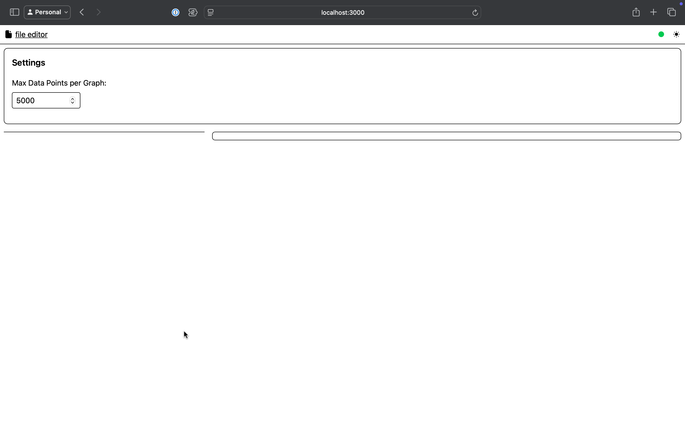

# Waggle Manual

## Table of Contents
- [Overview](#overview)
- [Warnings](#warnings)
- [Introduction](#introduction)
- [What You'll Need](#what-youll-need)
- [Getting Started](#getting-started)
  - [Installation](#installation)
- [Basic Usage](#basic-usage)
  - [Sending Data to Waggle](#sending-data-to-waggle)
- [Displaying Other Elements](#displaying-other-elements)
- [FAQ](#faq)
- [Troubleshooting](#troubleshooting)
- [Glossary](#glossary)
- [Additional Resources](#additional-resources)

## Overview

Waggle is a graphing and debugging dashboard initially created for the CU Robotics team, however it has since proven to be a valuable, problem agnostic tool. This document is intended to get you up and running with your first graph in no time!


https://github.com/user-attachments/assets/3a3af2b8-a265-4fd5-a25b-947d003e2ff0


## Warnings

Waggle was built and is primarily maintained for the CU Robotics team. Some of the tooling can be a little disjointed or split across subdirectories in different repositories. That said, you interact with the main server through a simple API. If there's a tool you want or you need to spin up a waggle client in a new language, the process is fairly trivial.

## Introduction

Debugging complex systems, especially in fields like robotics, often requires visualizing multiple data streams simultaneously. Traditional logging approaches can be limiting when you need to:

- Track multiple sensor values over time
- Visualize spatial data or camera feeds
- Monitor system state changes
- Identify patterns or anomalies in real-time data

Waggle addresses these needs by providing a flexible, web-based dashboard that can display:

1. **Real-time graphs** of any numeric data
2. **Image displays** for camera feeds or visualizations
3. **Status information** as text values

The system uses a simple HTTP-based API to receive data and WebSockets to push updates to the browser in real-time, making it simple to integrate with various systems.

## What You'll Need

All you need is a basic Linux, Mac, or Windows computer to act as the server (in our case, that's the robot's on-board computer!). There are also many tools that allow Waggle to receive data over Serial from a microcontroller, over the internet with an ESP-32, or from any computer capable of running the client script.

## Getting Started

### Installation

Waggle requires both Go to run the API and serve the static frontend files. These instructions are for a unix system (Mac/Linux), however Windows is also supported.

1. **Install [Go](https://go.dev/):**

   ```bash
   sudo snap install go --classic
   ```

3. **Download Waggle:**

   ```bash
   cd && git clone https://github.com/CU-Robotics/waggle.git
   ```

5. **Build Waggle:**
   ```bash
   cd ~/waggle && go build
   ```

4. **Run Waggle**

   ```bash
   ./waggle
   ```

Now when you go to http://localhost:3000 you'll see the blank waggle page




## Basic Usage

### Sending Data to Waggle

To send data to Waggle, you'll need to make HTTP POST requests to the `/batch` endpoint with a JSON payload. The basic structure is:

```json
{
  "sent_timestamp": 1625097600,
  "graph_data": {
    "Temperature": [
      { "x": 1625097600, "y": 25.5 }
    ],
    "Humidity": [
      { "x": 1625097600, "y": 45.2 }
    ]
  },
  "images": {
    "Camera Feed": {
      "image_data": "base64_encoded_image_data",
      "scale": 1,
      "flip": false
    }
  },
  "string_data": {
    "Status": { "value": "Running" },
    "Mode": { "value": "Autonomous" }
  }
}
```

For Python users, a simple example would be:

```python
import requests
import json
import time
import base64
import cv2

# Create data payload
data = {
    "sent_timestamp": time.time(),
    "graph_data": {
        "Sensor Reading": [
            {"x": time.time(), "y": 42.0}
        ]
    },
    "string_data": {
        "Status": {"value": "OK"}
    }
}

# Send to Waggle
response = requests.post(
    "http://localhost:3000/batch",
    data=json.dumps(data)
)
```


There are in-progress Waggle libraries for C++, Python,  and Rust, as well as a tool to intercept Serial output. All of these will be *officially* released after a little bit more work. In the mean time, many of them can be found scattered throughout various CU Robotics repositories (Note: some of these are currently closed-source and for internal use only)

## Displaying Other Elements

https://github.com/user-attachments/assets/e2309845-6b4f-4e25-aed0-b9b8637f5fde

Where waggle becomes super versatile is in its ability to display any piece of data through generated images. On the CU Robotics team, we generate OpenCV Mats, then encode the images as jpg-base64. The image data can then be sent as
```json
{
  "sent_timestamp": 1745020248.154549,
  "graph_data": {
      "Sensor Reading": [
          {"x": 1745020248.154549, "y": 42.0}
      ]
  },
  "string_data": {
      "Status": {"value": "OK"}
  },
  "images": {
  	"my_img": "…lR9jH90flV/yk9KPKT0o5Q5Ef"
	}
}

```


## FAQ

**Why "Waggle?" Such a strange name...**

Our robotics team's main robot software is called "Hive," as it is one piece software that controls many robots. In a bee hive, the bees communicate with a [waggle dance](https://en.wikipedia.org/wiki/Waggle_dance). This is a piece of software to allow Hive to communicate, hence, Waggle!

**How can I support this project?**

Use the tool and give feedback! Open a pull request with improvements if you have the know-how.

## Troubleshooting

If you run into any issues, post an issue on GitHub.

## Glossary

## Additional Resources

Learn more about:

* [OpenCV Mats](https://docs.opencv.org/3.4/d3/d63/classcv_1_1Mat.html)

Waggle used outside CU Robotics:
* [UChicago Trading Competition](https://eff.sh/UChicago-Trading-Competition-2025/case-1/)
